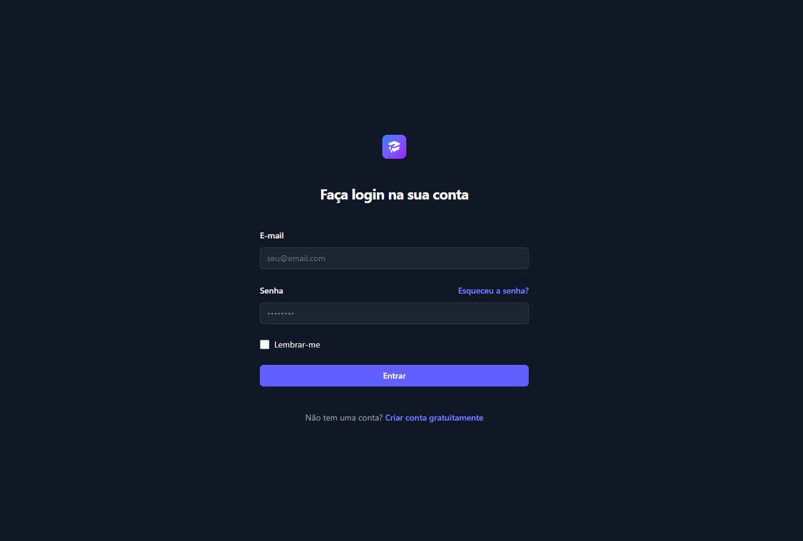
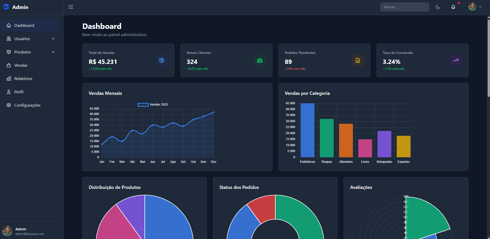

# LaraSaaS

Sistema SaaS moderno desenvolvido com Laravel, focado em gestão administrativa com interface elegante e responsiva.

## 📋 Sobre o Projeto

LaraSaaS é uma plataforma SaaS completa construída com Laravel 12 e Tailwind CSS, oferecendo um painel administrativo robusto com gestão de usuários, autenticação segura, e visualização de dados através de gráficos interativos.

## 🚀 Preview do Sistema

<div align="center">
     <br>    
</div>

<br>
<div align="center">
     <br>    
</div>

### ✨ Funcionalidades

- 🔐 **Sistema de Autenticação Completo**
  - Login e registro de usuários
  - Recuperação de senha via e-mail
  - Reset de senha com token seguro
  - Proteção de rotas com middleware

- 🔒 **Sistema de Controle de Acesso (ACL)**
  - Hierarquia: Módulos → Permissões → Roles → Usuários
  - Permissões baseadas em rotas nomeadas do Laravel
  - Middleware automático de verificação de acesso
  - Role de Admin com acesso total (bypass)
  - Gates customizados para verificações programáticas
  - Diretivas Blade (@can, @cannot, @canany)
  - Interface administrativa completa para gestão
  - Organização visual de permissões por módulo
  - **Seletor visual de ícones** com 200+ opções (Font Awesome e Bootstrap Icons)
  - **Reordenação de módulos via drag-and-drop** com persistência automática
  - Componentes reutilizáveis (user-card, icon-picker)
  - [Documentação completa do ACL](docs/ACL.md)
  - [Documentação do Icon Picker](docs/ICON-PICKER.md)

- 👥 **Gestão de Usuários (CRUD Completo)**
  - Listagem com busca inteligente por nome/e-mail
  - Paginação eficiente (15 usuários por página)
  - Criação de novos usuários com validação
  - Edição de dados com atualização de avatar
  - Exclusão com confirmação via SweetAlert2
  - Proteção contra auto-exclusão
  - **Sistema avançado de upload de fotos de perfil:**
    - Preview em tempo real da imagem selecionada
    - **Crop e ajuste de imagem** com Cropper.js
    - Interface interativa com zoom e movimentação
    - Redimensionamento automático para 500x500px
    - Suporte a JPG, PNG e GIF (máx. 2MB)
    - Validação de tamanho e formato
    - Remoção de foto com confirmação via SweetAlert2
  - Visualização detalhada com estatísticas
  - **Sistema de presença online/offline em tempo real**
  - Indicador visual de status (bolinha verde para online)
  - Rastreamento de última atividade e último login
  - Mensagens contextuais: "Online", "Visto há X minutos", "Offline", "Nunca ativo"
  - Atribuição de roles com controle de acesso

- 🟢 **Sistema de Presença Online**
  - Detecção automática de usuários online (últimos 5 minutos)
  - Atualização em tempo real via middleware
  - Indicadores visuais discretos no avatar (bolinha verde)
  - Card no dashboard mostrando usuários online
  - Registro de último login e última atividade
  - **Limpeza automática de sessões expiradas:**
    - Comando agendado a cada 10 minutos via Laravel Scheduler
    - Marca usuários como offline quando sessão expira
    - Remove sessões antigas do banco de dados
    - Previne que usuários apareçam online após fechar navegador
    - Garante consistência entre sessão e status online
  - **Logout inteligente** com marcação imediata como offline
  - Mensagens inteligentes de status:
    - "Online" - usuário ativo no momento
    - "Visto há X minutos/horas" - offline recente (até 7 dias)
    - "Offline" - inativo há mais de 7 dias
    - "Nunca ativo" - usuário nunca fez login
  - Grid responsivo com até 12 usuários visíveis
  - Sistema robusto com comandos manuais disponíveis
  - [Documentação completa do sistema](docs/SCHEDULER.md)

- 📊 **Dashboard de Usuário**
  - Cards com métricas (vendas, produtos)
  - Gráfico de linha (vendas mensais)
  - Gráfico de rosca (produtos por categoria)
  - Dados simulados para demonstração
  - Design responsivo e interativo

- 🎨 **Interface Moderna**
  - Tema dark/light com persistência via localStorage
  - Alternância instantânea sem delay
  - Sidebar responsiva com menu colapsável e hambúrguer
  - Persistência de estado do sidebar (aberto/fechado) via localStorage
  - Transições suaves sem flash ao carregar página
  - Menu auto-expansível baseado na rota atual
  - Notificações toast elegantes (SweetAlert2)
  - Feedback visual em todas as ações
  - **Componente visual de seleção de ícones** com preview e busca
  - **Drag-and-drop para reordenação** de itens com SortableJS

- 📊 **Dashboard Administrativo**
  - Interface moderna com tema dark/light
  - Sidebar responsiva com menu colapsável e controle por hambúrguer
  - Estado do sidebar persistido (respeita preferência do usuário)
  - Cards de estatísticas com métricas em tempo real
  - Card dedicado mostrando usuários online
  - 6 tipos de gráficos (Chart.js)
  - Timeline de atividades
  - Indicadores de presença online integrados

- 👤 **Gestão de Perfil**
  - Edição de informações pessoais
  - **Sistema avançado de gestão de foto de perfil:**
    - Upload com preview em tempo real
    - Crop e ajuste interativo da imagem
    - Redimensionamento automático para 500x500px
    - Preview fixo em 150x150px
    - Remoção permanente com confirmação SweetAlert2
  - Alteração de senha com validação
  - Zona de perigo para ações irreversíveis

- 🔔 **Sistema de Notificações**
  - SweetAlert2 para alertas e confirmações
  - Toast notifications no canto superior direito
  - Feedback visual para success, error, warning e info
  - Confirmação antes de ações destrutivas
  - Timer com barra de progresso (3 segundos)

### 🛠️ Tecnologias Utilizadas

#### Backend
- **Laravel** 12.40.2 - Framework PHP moderno
- **PHP** 8.4.15 - Linguagem de programação
- **MySQL** 8.0 - Banco de dados relacional
- **Laravel Sail** - Ambiente Docker para desenvolvimento

#### Frontend
- **Tailwind CSS** 4.0 - Framework CSS utility-first
- **Alpine.js** 3.x - Framework JavaScript reativo e leve
- **Livewire Flux** 2.9.0 - Componentes UI premium
- **Chart.js** - Biblioteca para gráficos interativos
- **SweetAlert2** - Biblioteca para modais e notificações elegantes
- **Cropper.js** 1.6.1 - Biblioteca para crop e edição de imagens
- **SortableJS** 1.15.1 - Biblioteca para drag-and-drop
- **Font Awesome** 6.5.1 - Biblioteca de ícones (200+ ícones disponíveis)
- **Bootstrap Icons** 1.11.3 - Biblioteca de ícones alternativa
- **Vite** 7.2.4 - Build tool moderno e rápido

#### Ferramentas de Desenvolvimento
- **Docker** - Containerização via Laravel Sail
- **Composer** - Gerenciador de dependências PHP
- **NPM** - Gerenciador de pacotes JavaScript
- **Git** - Controle de versão
- **Laravel Scheduler** - Sistema de tarefas agendadas em background ([detalhes](docs/SCHEDULER.md))

#### Qualidade de Código
- **Pest** 4.1 - Framework de testes moderno (100% coverage) 🎯
- **Laravel Pint** 1.24 - Formatação automática PSR-12 + Laravel
- **Larastan + PHPStan** 3.0/2.1 - Análise estática profunda (nível 6)
- **Pre-commit Hooks** - Verificações automáticas antes de commit
- **GitHub Actions CI** - Pipeline de qualidade e testes automatizados
- 📚 **[Guia Completo do Desenvolvedor](docs/DEVELOPER_GUIDE.md)** - Comandos, boas práticas e troubleshooting

#### Recursos e Integrações
- **Storage** - Sistema de arquivos com link simbólico para avatares
- **Middleware** - Proteção de rotas, autenticação e rastreamento de atividade
- **Form Requests** - Validação robusta de formulários
- **Eloquent ORM** - Interação com banco de dados
- **Blade Templates** - Engine de templates do Laravel
- **Real-time Presence** - Sistema de presença online com atualização automática
- **ACL System** - Controle de acesso baseado em Roles e Permissions (veja [documentação do ACL](docs/ACL.md))
- **Icon Picker** - Componente visual para seleção de ícones (veja [documentação](docs/ICON-PICKER.md))
- **Drag & Drop** - Reordenação interativa com SortableJS e Livewire
- **Laravel Scheduler** - Tarefas agendadas automatizadas via Docker (veja [documentação completa](docs/SCHEDULER.md))

## 📋 Requisitos

Antes de começar, certifique-se de ter instalado em sua máquina:

- **Docker Desktop** - [Download](https://www.docker.com/products/docker-desktop)
- **Git** - [Download](https://git-scm.com/downloads)
- **Composer** (opcional, se não usar Sail) - [Download](https://getcomposer.org/)

### Requisitos de Sistema

- Sistema Operacional: Windows 10/11, macOS, ou Linux
- Memória RAM: Mínimo 4GB (8GB recomendado)
- Espaço em Disco: 2GB disponíveis
- Portas disponíveis: 8080 (aplicação), 3306 (MySQL), 3307 (MySQL de testes), 5173 (Vite/HMR)

## 🚀 Instalação e Configuração

### 1. Clone o Repositório

```bash
git clone https://github.com/blackskulp/larasaas.git
cd larasaas # ou o nome de pasta que você escolheu
```

### 2. Configure o Arquivo de Ambiente

```bash
cp .env.example .env
```

Ajuste as seguintes variáveis no arquivo `.env`:

```env
APP_NAME=LaraSaaS
APP_URL=http://localhost
APP_PORT=8080

DB_CONNECTION=mysql
DB_HOST=mysql
DB_PORT=3306
DB_DATABASE=larasaas
DB_USERNAME=sail
DB_PASSWORD=password
```

### 3. Instale as Dependências

```bash
# Instalar dependências do Composer via Docker
docker run --rm \
    -u "$(id -u):$(id -g)" \
    -v "$(pwd):/var/www/html" \
    -w /var/www/html \
    laravelsail/php84-composer:latest \
    composer install --ignore-platform-reqs
```

### 4. Suba tudo com um único comando

A partir de agora basta executar:

```bash
docker compose up -d


```

O serviço `laravel.test` usa o script `docker-entrypoint.sh`, que automatiza:

- `composer install` (se o diretório `vendor` ainda não existir)
- `npm install` + `npm run build` (apenas no primeiro start)
- Ajustes de permissões em `storage` e `bootstrap/cache`
- `php artisan key:generate` (caso `APP_KEY` esteja vazio)
- `php artisan storage:link`
- `php artisan migrate --force` (após garantir que o MySQL está pronto)

Com isso, ao clonar o projeto e rodar `docker compose up -d`, a aplicação já está pronta para uso.

> Caso prefira, ainda é possível usar o Sail normalmente: `./vendor/bin/sail up -d`, `./vendor/bin/sail artisan ...`, etc.

### 5. (Opcional) Execute passos manualmente

Os comandos abaixo continuam disponíveis para rodar manualmente se você quiser repetir algum passo específico:

- `./vendor/bin/sail artisan key:generate`
- `./vendor/bin/sail artisan migrate`
- `./vendor/bin/sail artisan storage:link`
- `./vendor/bin/sail npm install`
- `./vendor/bin/sail npm run dev`
- `./vendor/bin/sail npm run build`
- `./vendor/bin/sail artisan db:seed`

## 🎯 Comandos Principais do Sail

### Gerenciamento de Containers

```bash
# Iniciar containers
./vendor/bin/sail up

# Iniciar em background
./vendor/bin/sail up -d

# Parar containers
./vendor/bin/sail down

# Reiniciar containers
./vendor/bin/sail restart

# Ver logs
./vendor/bin/sail logs

# Ver logs de um serviço específico
./vendor/bin/sail logs mysql
```

### Comandos Artisan

```bash
# Executar qualquer comando Artisan
./vendor/bin/sail artisan [comando]

# Exemplos:
./vendor/bin/sail artisan migrate
./vendor/bin/sail artisan migrate:fresh --seed
./vendor/bin/sail artisan cache:clear
./vendor/bin/sail artisan config:clear
./vendor/bin/sail artisan route:list
./vendor/bin/sail artisan make:controller NomeController
./vendor/bin/sail artisan make:model NomeModel -m

# Comandos do Sistema de Presença Online
./vendor/bin/sail artisan users:update-online-status    # Atualiza status e mostra estatísticas
./vendor/bin/sail artisan sessions:clean-expired        # Limpa sessões expiradas
```

**Nota:** Para executar comandos dentro do container Docker sem Sail:
```bash
docker compose exec laravel.test php artisan sessions:clean-expired
docker compose exec laravel.test php artisan users:update-online-status
```

### Comandos Composer

```bash
# Instalar dependências
./vendor/bin/sail composer install

# Atualizar dependências
./vendor/bin/sail composer update

# Adicionar pacote
./vendor/bin/sail composer require nome/pacote
```

### Comandos NPM

```bash
# Instalar dependências
./vendor/bin/sail npm install

# Executar em modo desenvolvimento
./vendor/bin/sail npm run dev

# Build para produção
./vendor/bin/sail npm run build

# Executar testes
./vendor/bin/sail npm test
```

### Banco de Dados

```bash
# Acessar MySQL via linha de comando
./vendor/bin/sail mysql

# Executar tinker (REPL do Laravel)
./vendor/bin/sail tinker

# Backup do banco
./vendor/bin/sail exec mysql mysqldump -u sail -p larasaas > backup.sql
```

### Testes

```bash
# Executar todos os testes
./vendor/bin/sail test

# Executar testes com cobertura
./vendor/bin/sail test --coverage

# Executar teste específico
./vendor/bin/sail test --filter NomeDoTeste
```

### Alias para Sail (Opcional)

Para facilitar, adicione um alias ao seu shell:

```bash
# Para Bash
echo "alias sail='./vendor/bin/sail'" >> ~/.bashrc
source ~/.bashrc

# Para Zsh
echo "alias sail='./vendor/bin/sail'" >> ~/.zshrc
source ~/.zshrc
```

Após configurar o alias, você pode usar apenas `sail` ao invés de `./vendor/bin/sail`:

```bash
sail up -d
sail artisan migrate
sail npm run dev
```

## 📱 Acessando a Aplicação

Após iniciar os containers, acesse:

- **Aplicação**: http://localhost:8080
- **Vite (HMR em desenvolvimento)**: http://localhost:5173

### Credenciais Padrão

Se você executou o seeder, use:

```
Email: admin@larasaas.com
Senha: password
```

## 📂 Estrutura do Projeto

```text
larasaas/
├── app/
│   ├── Console/Commands/       # Comandos de sessão/status/menu
│   ├── Http/
│   │   ├── Controllers/
│   │   │   ├── Admin/          # Dashboard, Users, Roles, Permissions, Modules, Menus, Sectors, Procedures
│   │   │   └── Auth/           # Login, registro, recuperação/reset de senha
│   │   ├── Middleware/         # CheckPermission e UpdateLastActivity
│   │   └── Requests/Admin/     # Form Requests de validação
│   ├── Livewire/Admin/         # MenusTable e ModulesTable
│   ├── Models/                 # User, Role, Permission, Module, Menu, Sector, Procedure*
│   ├── Providers/
│   └── View/Components/
├── bootstrap/
├── config/
├── database/
│   ├── factories/
│   ├── migrations/             # ACL + setores/procedimentos + sessão/cache/jobs/pulse
│   └── seeders/
│       ├── DatabaseSeeder.php
│       ├── RolePermissionSeeder.php
│       ├── ModuleSeeder.php
│       ├── MenuSeeder.php
│       └── ProcedureTestSeeder.php
├── docs/
│   ├── ACL.md
│   ├── DEVELOPER_GUIDE.md
│   ├── ICON-PICKER.md
│   ├── QUALITY.md
│   ├── SCHEDULER.md
│   └── TESTING_DATABASE.md
├── public/
│   └── data/icons.json
├── resources/
│   ├── css/
│   ├── js/
│   └── views/
│       ├── admin/              # users, roles, permissions, modules, menus, sectors, procedures
│       ├── auth/
│       ├── components/
│       ├── layouts/
│       └── livewire/admin/
├── routes/
│   ├── web.php
│   └── console.php
├── scripts/
├── tests/
├── compose.yaml
└── docker-entrypoint.sh
```

## 🧩 Renomear Pasta do Projeto (Docker)

Ao renomear a pasta local, o Docker Compose pode criar um novo namespace de volumes. Na prática, a aplicação sobe, mas pode apontar para um banco “novo” sem usuários/ACL seedados.

Se isso acontecer, rode:

```bash
docker compose up -d
docker compose exec laravel.test php artisan migrate --force
docker compose exec laravel.test php artisan db:seed
```

Isso recria admin, roles e permissões padrão.

## 📚 Documentação Completa

Para uma experiência de desenvolvimento otimizada, consulte nosso guia completo:

### 🛠️ [Guia do Desenvolvedor](docs/DEVELOPER_GUIDE.md)

Nosso guia abrangente contém:

- ✅ **Configuração inicial** - Setup completo do ambiente
- 🔧 **Ferramentas de qualidade** - Pest, Pint, Larastan/PHPStan  
- 💻 **Comandos úteis** - Todos os comandos do dia a dia
- 📚 **Boas práticas** - Padrões de código, testes, ACL
- 🔄 **Workflow de desenvolvimento** - Features, bugfixes, refactoring
- 🔒 **Pre-commit hooks** - Verificações automáticas
- 🚦 **CI/CD** - Pipeline de qualidade automatizado
- 🧪 **Testes** - Estrutura, cobertura, boas práticas
- 🔍 **Troubleshooting** - Soluções para problemas comuns

### 📖 Outras Documentações

- [Sistema de ACL](docs/ACL.md) - Controle de acesso completo
- [Icon Picker](docs/ICON-PICKER.md) - Seletor visual de ícones
- [Laravel Scheduler](docs/SCHEDULER.md) - Tarefas agendadas
- [SonarQube](docs/SONARQUBE.md) - Análise de qualidade contínua
- [Qualidade de Código](docs/QUALITY.md) - Ferramentas e processos

---

## 🧪 Qualidade de Código

Este projeto mantém **100% de cobertura de testes** e utiliza ferramentas profissionais de qualidade de código:

### Ferramentas Integradas

- 🎯 **Pest 4.1** - 362 testes, 100% de cobertura
- 🎨 **Laravel Pint 1.24** - Formatação automática PSR-12
- 🔍 **Larastan 3.0 + PHPStan 2.1** - Análise estática (nível 6)
- 🔒 **Pre-commit Hooks** - Validação antes de cada commit
- 🚀 **GitHub Actions CI** - Pipeline automatizado
- 📊 **SonarQube** - Análise contínua de qualidade ([guia completo](docs/SONARQUBE.md))

### Comandos Rápidos

```bash
# Formatação de código
composer pint

# Análise estática
composer phpstan

# Executar testes
composer test

# Testes com cobertura mínima de 90%
composer test:coverage

# Gerar relatório de coverage para SonarQube (local)
composer test:coverage-report

# Executar análise do SonarQube (local, usa .env)
composer sonar

# Executar TODAS as verificações
composer pint && composer phpstan && composer test:coverage
```

### Pre-commit Hooks

Ao fazer commit, as seguintes verificações são executadas automaticamente:

1. **Pint** detecta e corrige problemas de formatação
2. **PHPStan** analisa código em busca de erros de tipo
3. Commit é **bloqueado** se houver problemas

Para mais detalhes, consulte o [Guia do Desenvolvedor](docs/DEVELOPER_GUIDE.md#pre-commit-hooks).

---

## 🤝 Como Contribuir

Contribuições são sempre bem-vindas! Para contribuir com o projeto:

### 1. Faça um Fork do Projeto

Clique no botão "Fork" no canto superior direito da página do repositório.

### 2. Clone seu Fork

```bash
git clone https://github.com/seu-usuario/larasaas.git
cd larasaas
```

### 3. Crie uma Branch para sua Feature

```bash
git checkout -b feature/nova-funcionalidade
```

### 4. Configure o Ambiente

```bash
# Instalar dependências e configurar hooks
composer setup

# Iniciar containers
./vendor/bin/sail up -d
```

### 5. Faça suas Alterações

Siga as **boas práticas do projeto** (detalhes no [Guia do Desenvolvedor](docs/DEVELOPER_GUIDE.md)):

- ✅ **PSR-12** para código PHP (Pint faz automaticamente)
- ✅ **Type hints** em todos os métodos
- ✅ **Testes** para novas funcionalidades (mínimo 90% coverage)
- ✅ **Form Requests** para validação
- ✅ **Services/Actions** para lógica de negócio
- ✅ **Factories** para Models
- ✅ **PHPDoc** para documentação

### 6. Verificações de Qualidade

```bash
# Formatar código
composer pint

# Análise estática
composer phpstan

# Testes com cobertura
composer test:coverage

# OU executar todas as verificações
composer pint && composer phpstan && composer test:coverage
```

### 7. Commit suas Mudanças

Os **pre-commit hooks** executarão automaticamente antes de cada commit:

```bash
git add .
git commit -m "feat: adiciona nova funcionalidade X"
```

Use mensagens de commit semânticas:
- `feat:` nova funcionalidade
- `fix:` correção de bug
- `docs:` documentação
- `style:` formatação
- `refactor:` refatoração
- `test:` testes
- `chore:` tarefas gerais

### 6. Push para sua Branch

```bash
git push origin feature/nova-funcionalidade
```

### 7. Abra um Pull Request

Vá até a página do repositório original e clique em "New Pull Request". Descreva suas alterações detalhadamente.

### Diretrizes de Contribuição

- Mantenha o código limpo e bem documentado
- Siga os padrões de código existentes
- Teste suas alterações antes de submeter
- Atualize a documentação quando necessário
- Seja respeitoso com outros contribuidores
- Um PR deve resolver apenas um problema por vez

### Reportando Bugs

Se encontrar um bug, por favor abra uma [Issue](https://github.com/blackskulp/larasaas/issues) incluindo:

- Descrição clara do problema
- Passos para reproduzir
- Comportamento esperado vs atual
- Screenshots (se aplicável)
- Versão do sistema operacional e navegador

### Sugerindo Melhorias

Para sugerir melhorias, abra uma [Issue](https://github.com/blackskulp/larasaas/issues) com:

- Descrição da funcionalidade
- Justificativa (por que é útil)
- Exemplos de uso (se possível)

## 📄 Licença

Este projeto está sob a licença MIT. Veja o arquivo [LICENSE](LICENSE) para mais detalhes.

## 👨‍💻 Autor

**Claudinei**

- GitHub: [@claudinei-ferreira](https://github.com/claudinei-ferreira)
- LinkedIn: [claudinei-ferreira-de-jesus](https://linkedin.com/in/claudinei-ferreira-de-jesus)
- Email: claufersus@gmail.com

---

Desenvolvido com ❤️ usando Laravel e Tailwind CSS

<p align="center">
  <sub>Se este projeto foi útil para você, considere dar uma ⭐!</sub>
</p>

```bash
./vendor/bin/sail npm install

./vendor/bin/sail npm run dev

./vendor/bin/sail npm run build

./vendor/bin/sail npm test
```
